devEops :laughing: 开发自运维平台 :no_mouth: 后端
================================
[](https://travis-ci.org/YoLoveLife/DevOps)
[](https://github.com/YoLoveLife/devEops/releases)
[](./LICENSE.md) :yum: </br>

Author: [YoLoveLife.com](http://www.yolovelife.com) :ok_hand:  汪子哲 :fist: 徐晨亮 :facepunch: 张宇萍</br>
:heart: 感谢所有 :star: 我的人 你们是我前行的动力</br>
该项目为devEops的后端部分 前端部分请关注 :heart: [devEops-Web](https://github.com/YoLoveLife/devEopsWeb)</br>

运维体系解决方案(正在成长中)</br>
前后段分离啦！告别之前的Jinja2</br>
:muscle: 实践以资产、应用信息为中心的运维平台</br>
django模型 & rest-framework</br>
:muscle: 参考了诸多django项目 我的Django用的真的很棒</br>
travis & django TestCase</br>
:muscle: 单元测试 测试不规范但是努力去做

如果你关注：自动化运维、运维资源管理等内容  :star: 我,[分享](http://www.yolovelife.com)给其他的运维人员</br>
如果你关注：django开发、rest-framework等内容  :star: 我,[分享](http://www.yolovelife.com)给其他的开发者</br>
求求你们 :star: 我吧!!!   求求你们 :star: 我吧!!!   求求你们 :star: 我吧!!!</br>

*关于我开发中遇到的问题 我会写在issues当中供有需要的朋友 :mag: 查询*</br>
*这些问题都是在查询了诸多资料并亲身尝试大量解决方案 :grimacing: 最后得出的结论*</br>
*您可以在issues中搜索**helper**查看我写的相关问题 我写的很用心*</br>
*如果未找到您关注的问题或者您对我的项目有建议请在issues和我讨论 :heart: 期待收到您的信息*</br>

## Contents
* [介绍](#introduce)
* [平台一览](#looklike)
* [如何安装](#howtoinstall)
* [自运维功能实现](#whatcando)
## <a name="introduce"> 介绍 </a>
本开发自运维平台致力于IT资源信息的整合与自动化运维，通过服务、应用配置的信息整合来运维提供帮助。</br>
devEops正在不断成长
- 所有运维操作都基于信息整合的正确性和一致性(资产信息管理) :floppy_disk: </br>
- 对接VMware|Aliyun自动拉取信息入库资产 </br>
- :bar_chart: 提供各类信息统计图表(资产|运维)等</br>
- 基于Ansile的运维元操作|任务的定义</br>
- 基于WebSocket以及SSHProxy的工单操作 </br>
- 基于Django自带auth认证体系的资产与权限关联</br>
- 域名管理与解析信息查询与刷新</br>
- 详细权限操作，区分开发人员以及运维人员 </br>

## <a name="looklike"> 平台一览 </a>
### :muscle: 登陆界面
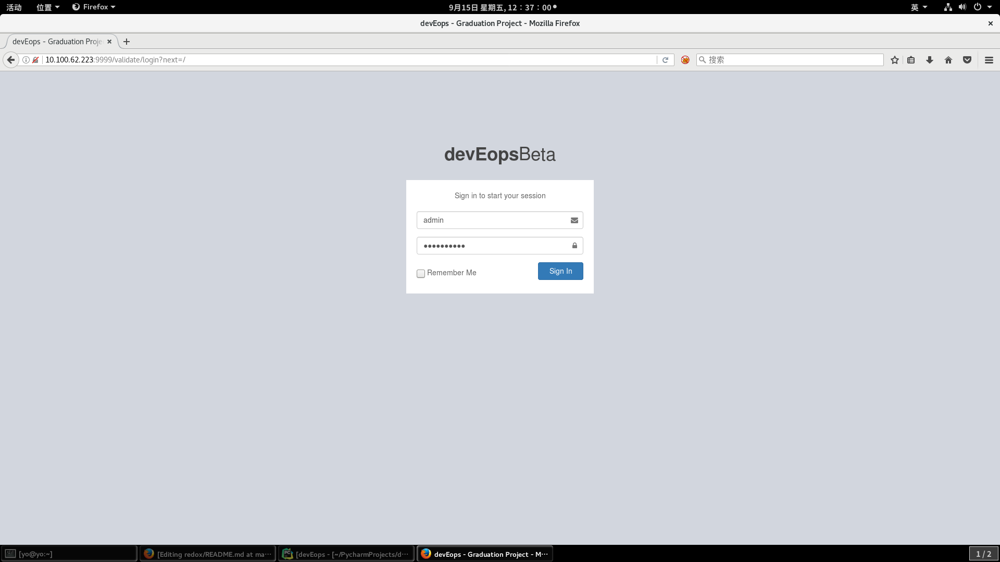</br>

### :muscle: 仪表盘界面
 :satisfied: 根据资源的检出位置|操作系统类型|运维操作 等图表化展现</br>
并且每周提供可供保存的静态页面的报告 **有！但是很丑** :grin:
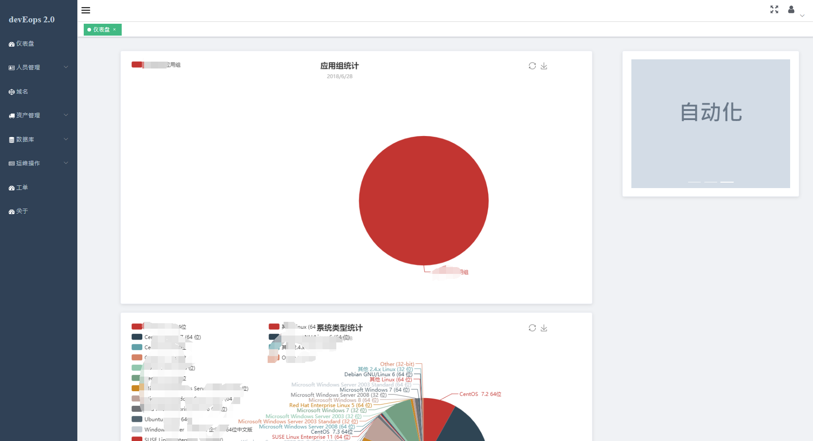

### :muscle: 资产管理
 :open_mouth: 资产根据来源(VMWARE|ALIYUN)入库 **运维人员进行归类**
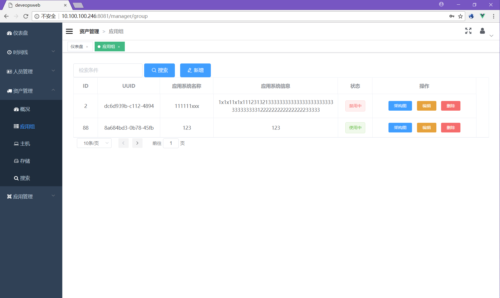</br>
应用组可定义架构图 关联跳板机以及密钥 :key: </br>
**应用组可全局添加参数 该参数会注入运维操作中的变量中**</br>
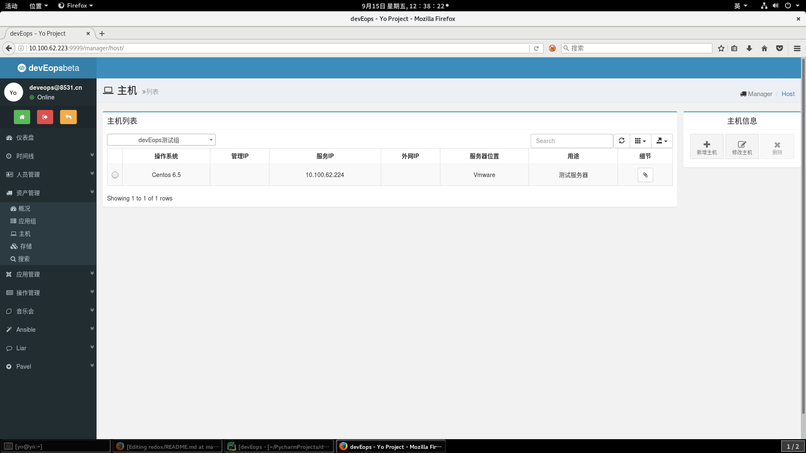
主机可以根据任意信息进行检索</br>
根据VMware|ALIYUN **API可进行详细信息(监控|配置)获取查看**</br>

### :muscle: 域名管理
基于树结构的域名管理 :relieved: 定时解析域名 保证记录域名解析正确 **供正反向查询**
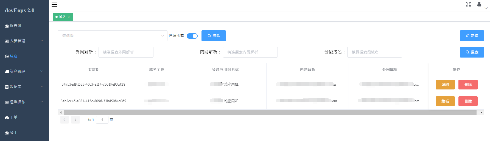

### :muscle: 密钥管理
**基于服务器端直接生成的ssh-rsa密钥** 私钥将会直接加密存储入数据库</br>
只有当您做运维操作|SSH连接的时候才会解析并且使用 :expressionless: </br>
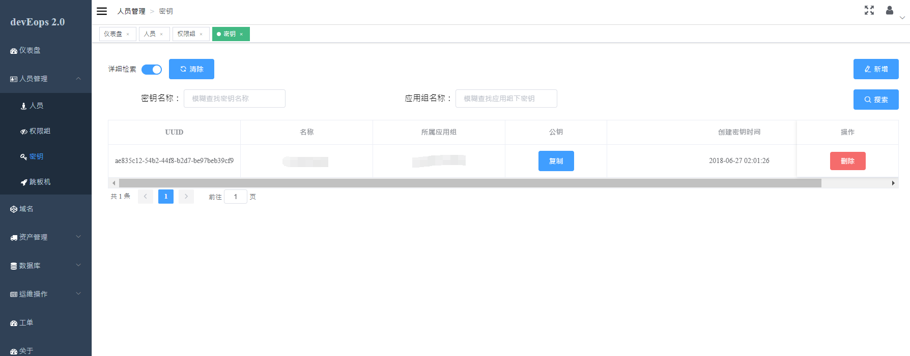

### :muscle: QR-Code
基于Google-Authority的**二次验证** :confused: 目前用户体系中已经包含验证+生成</br>


### :muscle: 元操作及任务
基于Ansible的数据模型 将用户的Ansible直接存储入数据库中</br>
当用户使用任务直接从CMDB中导出需要执行的主机列表以及参数列表 :smirk: **注入Ansible-API中**</br>
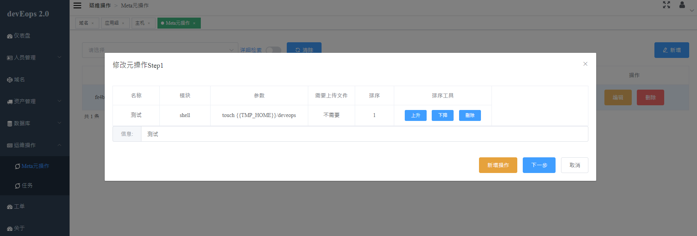
选择元操作所涉及的主机范围 :neutral_face: </br>
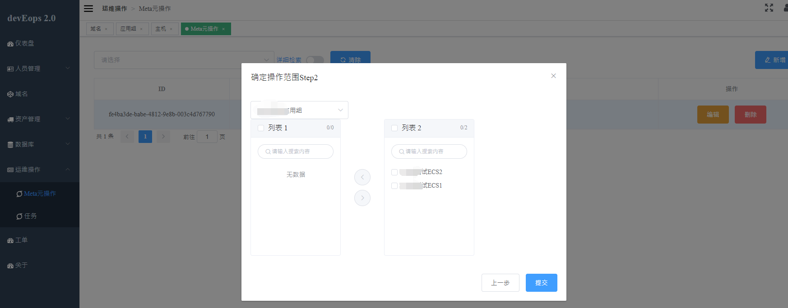
选择某个应用组下的若干个元操作组成一个任务</br>
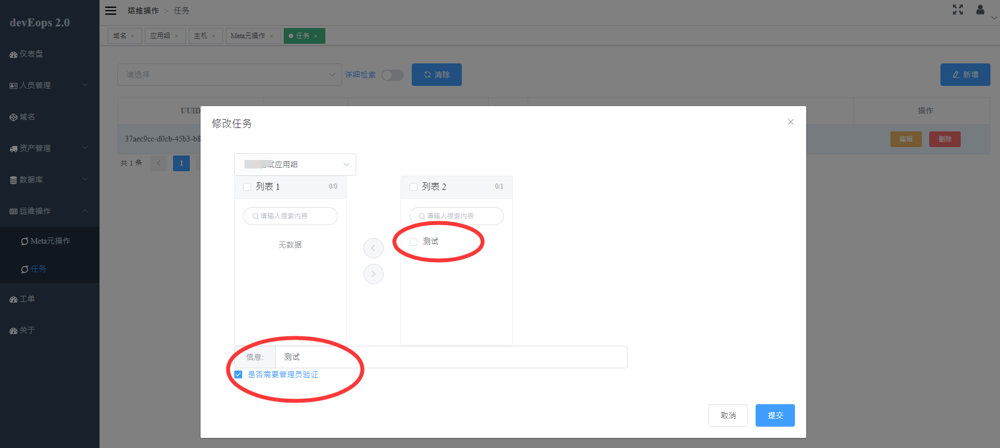

### :muscle: 工单系统
用户根据自身权限可以发布工单(涉及任务)进行执行</br>
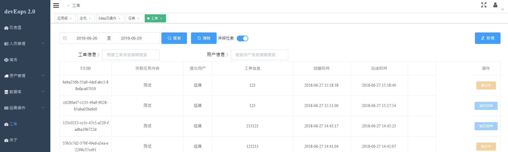
选择工单后用户可以进行执行 :punch: 系统**建立websocket**将所有执行结果返回
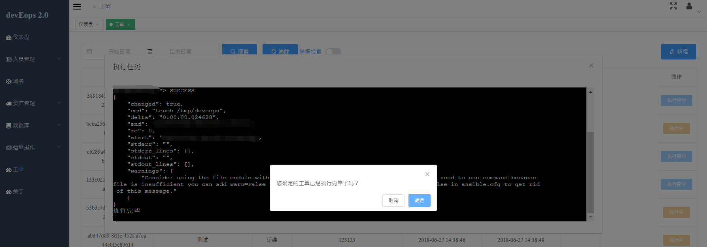

## <a name="howtoinstall"> 如何安装 </a>
devEops依赖于python3.5、诸多python第三方模块、mysql数据库、redis缓存</br>
以下操作环境已经拥有python3.5、mysql数据库、redis缓存
```bash
$ cd path/to/project/folder/

#安装部分依赖
yum install openssl-devel python3-devel openldap-devel

#安装python第三方库
$ pip install -r requirements.txt

#修改SSH的连接属性
$ vim /etc/ssh/ssh_config **注意是ssh_config而非sshd_config**
$ StrictHostKeyChecking no # 关闭指纹识别
$ :wq

#连接本地资源并创建数据表结构
$ vim deveops/conf.py # 里面包含了所有连接数据以及定时任务 请填写您需要的数据内容
$ python manage.py makemigrations
$ python manage.py migrate
$ # 删除表结构中的外键 减少运行过程中的锁争用问题、减少死锁概率、数据解耦
$ select concat("alter table ",table_schema,".",table_name, " drop foreign key ",CONSTRAINT_NAME,";") from INFORMATION_SCHEMA.KEY_COLUMN_USAGE where table_schema='deveops_v3' and REFERENCED_TABLE_NAME is not null into outfile '/tmp/fk_1.sql';

#启动服务
$ python manage.py runserver &
#默认启动在8000端口 你可能需要一个nginx做Web服务器
请务必配置一下Nginx代理来限制project/media下的访问权限 否则重要信息泄露的问题
```
## <a name="whatcando"> 自运维功能实现 </a>
