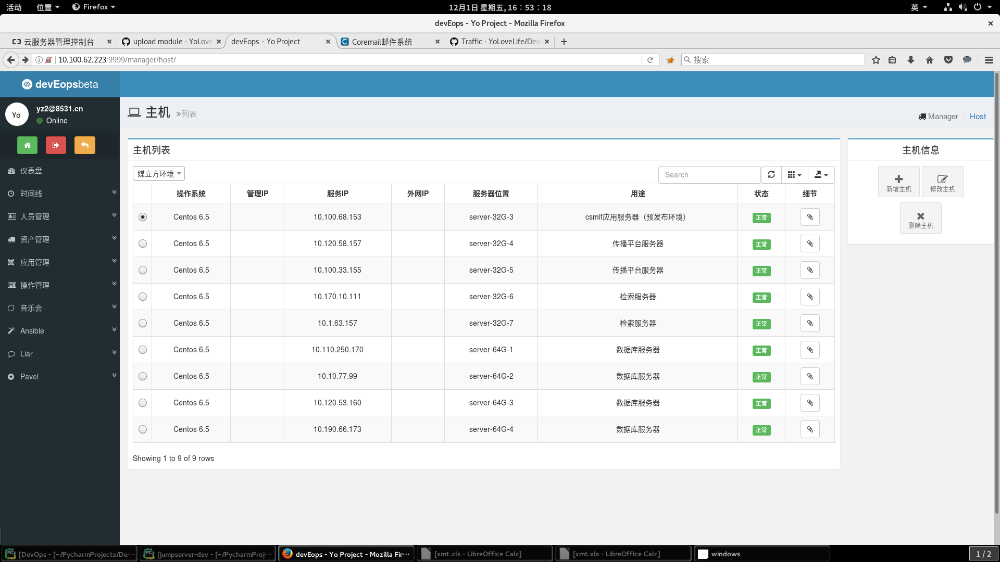

devEops :laughing: 开发自运维平台
================================

 

Author: [YoLoveLife.com](http://www.yolovelife.com) :ok_hand:  

运维体系解决方案 
:muscle: 已经努力让它适用于各种可能出现的生产环境 
django & rest-framework & bootstrap 
:muscle: 参考了诸多django项目 代码已经尽量优美 

如果你关注：自动化运维、运维资源管理等内容  :star: 我,[分享](http://www.yolovelife.com)给其他的运维人员 
如果你关注：django开发、rest-framework等内容  :star: 我,[分享](http://www.yolovelife.com)给其他的开发者 

*如果您有相关的问题或者建议请在issues和我讨论 :heart: 期待收到您的信息*

## Contents
* [介绍](#introduce)
* [平台一览](#looklike)
* [自运维功能实现](#whatcando)
* [如何安装](#howtoinstall)
## <a name="introduce"> 介绍 </a>
本开发自运维平台致力于IT资源信息的整合与自动化运维，通过服务、应用配置的信息整合来运维提供帮助。 

- 所有运维操作都基于信息整合的正确性和一致性(资产信息管理) :floppy_disk:  
- :bar_chart: 提供资产信息的统计,应用系统的占比、脚本|剧本的调用次数等 
- 可临时搜集应用上的信息(如MySQL的status等信息) 
- 所有运维操作(脚本 | 剧本)在提交的时候会自动注入资产信息并通过absible远程执行 
- 所有资产信息、架构信息都存储在数据库中供所有运维人员操作 
- 开发人员可登陆平台提交工单发起防火墙修改、应用发布、日常运维 :clock9: 等操作,运维人员许可操作进行 
- 所有应用发布、日常运维工作日程展示 :date:  
- 详细权限操作，区分开发人员以及运维人员 </r>

## <a name="looklike"> 平台一览 </a>

## <a name="whatcando"> 自运维功能实现 </a>
## <a name="howtoinstall"> 如何安装 </a>