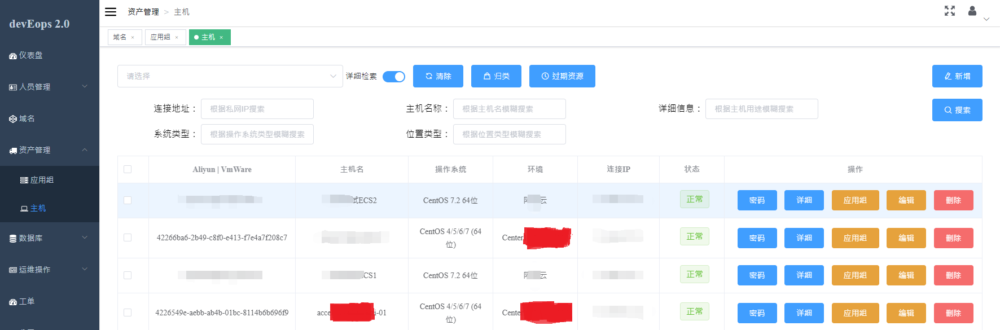
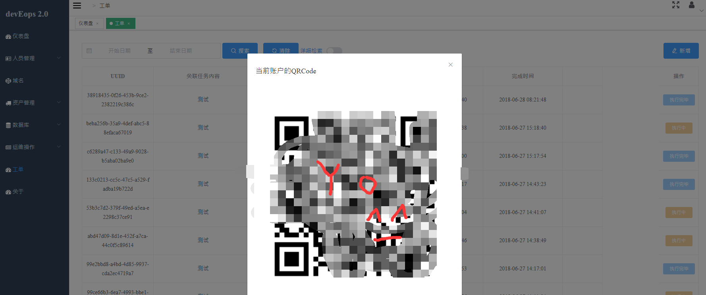
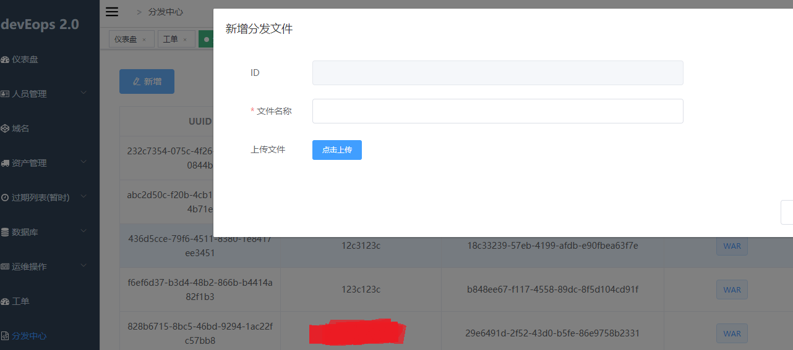
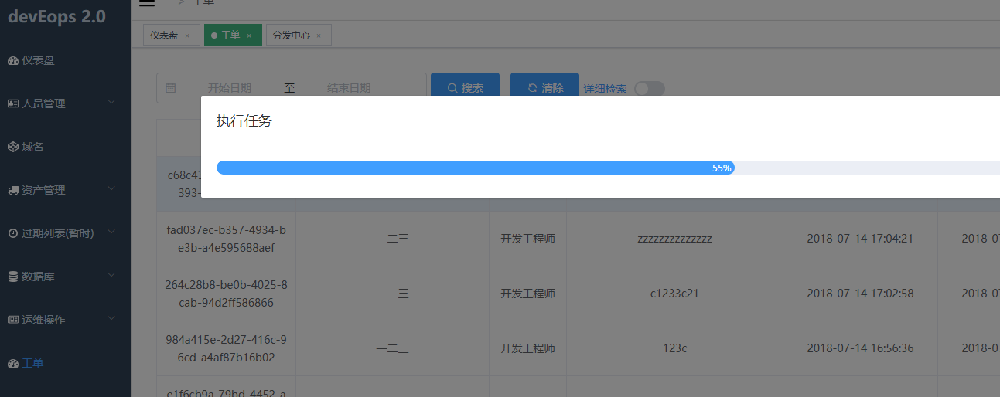
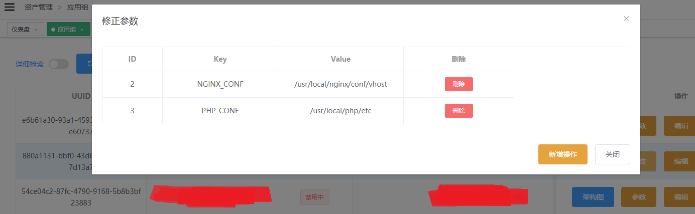

## 检索

您会惊喜的发现，现在我们的资产支持**多方位的检索**，您可以更快的找到自己所关注的资源，方便您进行归类整理。

  

我们为您预设了诸多您可能用的上的检索条件，例如在主机中您可以根据机器的IP|主机名称|位置|系统等信息来进行检索。  
让您更快的找到您管理的资源。

## 全自动的资产管理

我们的平台上需要保证的是**资产的正确性**。  
我们的工程师不应该将精力花费在添加主机、管理主机信息上。  
devEops会自动帮您维护资产信息。

?> **阿里云主机**  
我们通过阿里云API来入库机器，来维护机器是否是可使用的。
如果出现过期的资源，我们将在一定时间内保证资源是平台可见的，如果超过这个时限，那么我们认定资产是不需要的。

?> **VMware主机**  
我们使用VMwareAPI来维护机器是否可使用的。  
关于VMware主机的在线状态，我们在一定时间内尝试建立一个可用的SSH连接来判定主机状态。  
当我们使用CMDB去反查询VMware信息不存在时，我们会认定资产是不需要的。

?> **物理机**  
我们暂时还没什么办法去处理物理主机，至少从入库的角度上来说。  
您可能需要手动创建资产。  
资产的可用性我们会帮您维护。  

## 私人密钥

devEops引入了`Google Authority`作为重要操作的凭证。  
您可以通过右上角的QRCode来获取您的唯一认证信息，**注意只能获取一次**。
  
请下载具有身份验证器相关的应用来保存您的QRCode。
您可能会被要求在**任何需要认证**您身份的地方使用到该凭证，请务必保存好。
如果您不小心丢失了认证信息，您可能需要通知管理员为您重置了。

## 机器性能

2.0版本为了拉近用户与机器之间的距离，devEops做了很多努力。  
通过阿里云API以及~~VMware~~的API来获取您所想要看到的所有性能信息。  
  

您可以在资产信息中针对对应的主机查看详细的信息，我想这是您一直想要的。

## 分发中心

我们期待devEops平台成为所有用户与服务器之间的接口，无论是代码、配置文件。  
之前的FTP上传文件，无论对开发、对运维都是一种负担。  
是的，我们想解决批量上传文件的问题。  
2.0版本运维工程师可以通过工单定义上传文件的路径。  
您只需要在使用模块copy的时候使用 `src=file:{{WAR}} dest=/storage01/app.jar`  

当您执行工单的时候，平台会要求您提供一份已经在**分发中心已经上传成功**的文件。  
该文件就会以工单配置的形式分发到服务器上。  
这个文件也可能是您的代码包，目前我们只支持**300M**以下的文件分发。

## 工单发布

我想您其实并不需要工单具体是**如何执行**的是吗？  
1.0版本中我们将所有的执行细节展现给用户浏览，但是这恰恰是用户所**不关心**的。  
您只关心工单究竟成功完成没有，是吗？  

我们提供了更加友善的工单执行界面：**简洁 | 明了**  
我想您会喜欢这种进度条的方式。

## 应用组参数

我们认为在所有的业务中，是**不存在所谓的标准化**的。  
我们其实无法妥协已经上线的业务和未上线的业务，使他们的软件安装目录和业务发布目录全部相同。  
我们在业务的最大范围**应用组**中引入概念`组参数`。  

您可以在配置工单的**任何地方**引入该变量，使用**{{变量}}**的方式。  
该变量会在工单执行的时候注入到您的工单中。

## 跳板机器 + 密钥

我们觉得我们应该执着于之前的安全策略。  
`devEops平台 => 跳板机 => 管理机器`  
这样隔离的安全策略为我们的权限划分和管理提供了莫大的帮助。  
之前我们妥协过，直连机器在一个以资产为中心的平台仍旧是一个安全隐患。  
是的，您需要为纳入平台管理的业务系统提供一个跳板机器(网络可联通|配置底下)。  
2.0版本您不采用这种方式将无法为您的业务系统配置工单。

## 装机宝

作为运维工程师的您可能会想批量安装软件对吗？  
我们提供基于资产连接的playbook剧本，让您在~~弹指间~~完成软件安装。