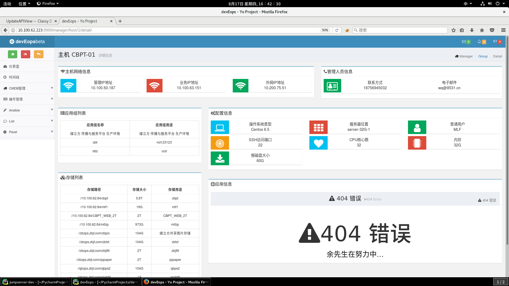
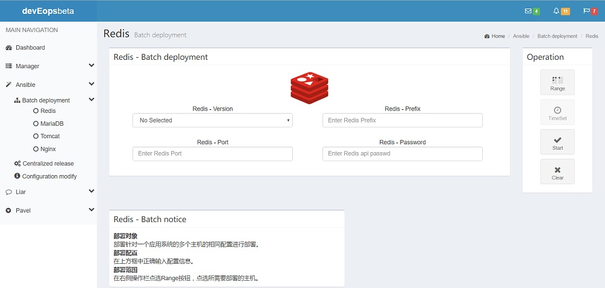

## Log
### 2017-11-10
#### Info
  更新了Ansible-API，删除了之前的将Ansible.hosts写入本地磁盘的方式。修改成将数据库的对象直接转换成Ansible所使用的参数变量的方式，更加合理。

### 2017-9-7
#### Info
  重新构建了devEops的用户体系，针对不同的页面添加了访问权限。完善了原本django自带的权限管理与用户管理。
  美化了页面UI。
  完成了playbook的编辑功能。

### 2017-8-22
#### Info
  完成bash脚本的增改查功能。
  
  所有脚本编辑功能跟预期的相同，具有参数列表、书写提醒、代码块添加。
#### For
 * 新增添group_detail页面，内容规划为 应用系统架构图、系统开发运维团队联系方式、应用主机列表、存储列表
 * Ansible底端API重新封装 采用普通用户key+sudo的方式执行anisble脚本
 * 用户体系权限构思

### 2017-8-17
#### Info
  完成CMDB全部的功能。
  
  CMDB包括应用组、存储、主机的相关信息的增删改，并且针对CMDB中的所有数据会有一个统计功能在dashboard中，因为目前数据比较少量，所以具体的数据
  分析的内容没有加入，只针对操作系统的类型以及不同应用的主机数目进行的图表。
  在逐步构建Operation模块的相关内容，
  
  Operation模块包括bash脚本和playbook剧本的书写和保存，到时候可以随时供ansible来调用。
  目前在针对bash脚本的书写在做后端接口和前端模板。

### 2017-7-5
#### Info
  毕业设计阶段的内容主要通过JS文件来与后台完成数据交互功能。在了解之后，其实django框架提供了自己说书写的JS相关功能，
  如页面的嵌套。并且在数据获取的方式django推荐采用form表单来做，而我们多采用ajax请求来做，在考虑之后觉得这样的方式很不
  健康，所以将这部分代码全部重构，可能需要一定的时间，但是可以对后期的代码编写带来很多的好处。

### 2017-5-5
#### Info
  将devEopsWeb的内容加入到devEops做一个前后台的接入。Group page中完成了后台数据的呈现。
#### For
  考虑将部署的位置Prefix写死为/usr/local，配置文件的位置写死为/etc下，这样后期管理的时候更加方便。

### 2017-4-19
#### Info
  构建了devEopsWeb的redis的部署界面。我觉得自己做的很棒！我觉得自己很帅！在构建提交的模态框，对于HTML和JS的提交的数据的存储方式提出问题。
#### Img
  

### 2017-4-18
#### Info
  构建了devEopsWeb的group页面和host页面。对dashboard的app-bell中的get more info按钮进行了ajax事件的绑定。
#### Bug
  * Page: pages/dashboard.html
  * Do: 点击app-bell元素中的 get more info <a>
  * Result: 两次点击中，一次点击会进行ajax页面修改。有一次会直接跳转到pages/host.html，样式全无。

### 2017-4-17
#### Info
  考虑到后期的功能拓展，重新构建更加好的前台模板。不使用已有的bootstrap模板，而是全部自己进行编码。
  目前已经构思了基础的dashboard界面以及group界面。可以沿用原来的js数据处理或者重构接口
#### For
* 完成host界面设计以及编码
* 前台代码重构

### 2017-4-6
#### Info
  考虑了一下模板的方式不能够解决多个版本的应用问题，如果要每个应用的每个版本都制作不同的应用模板就比较有问题了。采用修改配合文件的方式。
  使用ansible的fetch的模块来远程获取文件，并以时间戳的形式在/tmp目录下产生文件并且读取出来。当修改后，重新入这个文件，并且批量推送到主机上。
#### For
* 尝试使用原生的bootstrap来构建网页

### 2017-3-28
#### Info
  完成了除了Nginx之外的所有应用批量部署的功能。针对重新采用的动态主机列表，将底端的封装api重新修改，去除所有的server字段。
#### For
* 重新思考页面的业务解决方式(目前倾向于部署只部署应用 通过初始化来配置以及启动关闭)
* 在页面尝试配置修改并且批量推送的功能
* 数据库添加历史记录表 规划dashboard的组织方法